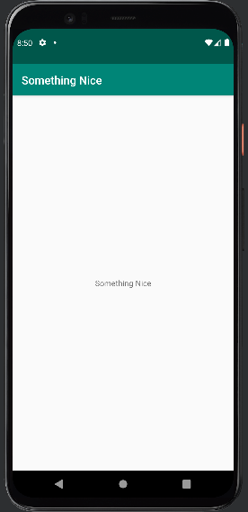

# Rapport

Repositorit Hello forkades och den forken clonades sedan till Github Desktop appen
där den senare öppnades i Android Studio.

I projektet så hittades strings.xml filen där dens texten mellan string taggarna
ändrades till "Something Nice" från "Hello" som visas i Kod 1. I kod 2 så visas koden som använder string taggen.
Den läser texten som finns i en string tagg med namnet "app_name" vilket är delen i Kod 1. Bild 1 visar hur
texten ser ut när den skrivs på skärmen.
```
<resources>
    <string name="app_name">Something Nice</string>
</resources>
```
Kod 1: XML som innehåller den text som ska visas
```
<TextView
    [...]
    android:text="@string/app_name"
    [...]/>

```
Kod 2: Text rutan som använder taggen i Kod 1




Bild 1: Bild på texten som skrivs